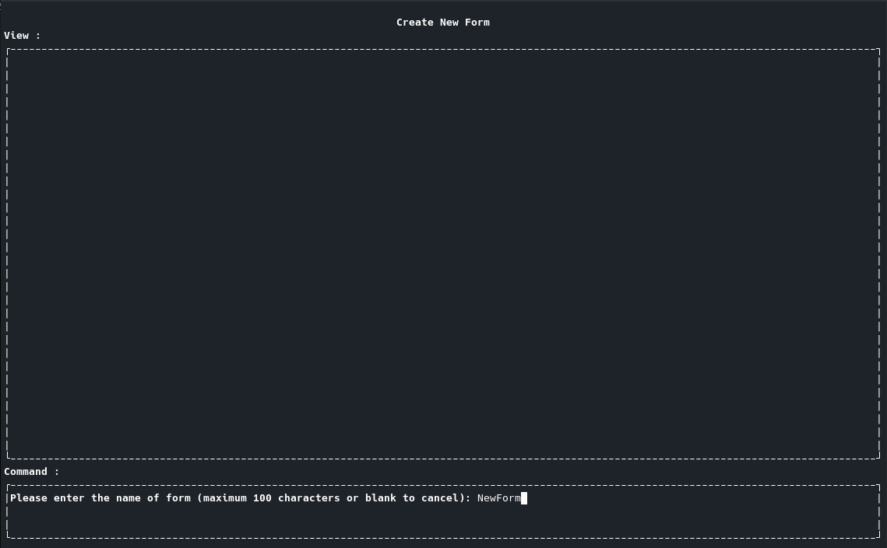

# PopProject

Principle of programming project.

A File Maker program which can Create, Edit, Manage forms implemented using pure C and ncurses.h library.

This project doesn’t have a GUI interface but I have used ncurses to develop a stunning TUI interface which is nothing short of GUI because I have implemented all of the functionalities and menus like a GUI interface 😎.

-   **Bulding Project:**

It's recommended to make program by Cmake so, for compiling on unix based operation systems by cmake run commands respectively:

First create a bulid directory where you cloned repository;

```
mkdir build-dir
```

Then go into build directory;

```
cd build-dir
```

Then give Cmake the top directory where .c and .h files exists as modules;

```
cmake ..
```

At the end make programm by make command at build directory;

```
make
```

-   **Main Menu:**

    This application has 3 functionalities:

        1.  Create form templates
        2.  Manage and fill out different samples of form templates.
        3.  Edit both templates and filled out forms.

    You can choose what to do from main menu using arrow keys.


   **Note:** You can adjust form size by pressing F2 button and using an interactive interface which has implemented using a TUI interface 😎.


-   **Create New Form:**

    In every page at first you should specify a form's name wheter for saving or opening it.



    You can design a form using three different elements, you could specify each element's specification and you could also edit them later in Edit Form page.


-   **Manage Forms:**

    At this page you could fill several copies of this form template out and then you could search between those filled out forms and delete them or also edit their data.


   **Cool Fact:** I've implemented these selecting windows somehow that they are scrollable, again in a TUI environment 😎.


-   **Edit Form:**

    Here you can do the magic, you could delete or add any component to the Form and then view the form.


**Note that the program would make two FormsTemplates and FormsData directories where it has been built;**

**Which would be used for saving Templates and all of Data respectively.**
